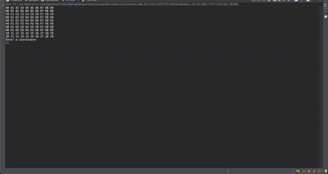

## Minesweeper

Recreate a simplified version of the game Minesweeper to be played in the java console

## Image

## Link

## Setup

- Eclipse IDE Ver. 4.25.0

## MVP

- The game should be able to randomly generate 10 mines in a 10x10 grid -[x]
- The user will be able to enter a command that represents a coordinate to check a location for a mine - [x]
- The application will display a number from 0-8 depending on how many mines surround that location - [x]
- If the user selects a mine, the game will respond "boom!" and the game will be lost - [x]
- If every non-mine square has been revealed, the game is won - [x]
- Render the grid to the console after every user command - [x]

## Bonuses (optional)

- Allow for the user to configure number of mines and grid size via a configuration.json file - []
- (Difficult) Discovering an empty square should reveal all squares around it, and cascade into other nearby empty squares - []

## Approach

- Create a class that generates a 10 x 10 grid
  - Created a nested for loop that prints a 10x10 grid with coordinates (A1).
  - Will need to generate 10 random coordinates to which will be the bomb locations
- Create another class that generates the position of the mines.
- When user inputs a position, grid will re-render but the position will show a number from 0-8.
- Create a main class that only calls a method/function that initiates the game.
- let the game board take one parameter which is a string coord.
  - if its a bomb location, put an X! and end the game.
  - if there is a bomb around it, put a number indidicating how many there are.
- Created a class called Bomb which handles the generation of the 10 coordinates and are put in a List<String>
  - Will need to refactor the grid generator function to print out a list instead.
  - We will then put in a parameter String coord which will get the list element and replace it with a number, an O or an X followed by a game over.
  - will need to create another function that does a check of all the coordinates around the user input.
  - Created a function that adds every userGuess to an arraylist.
  - game will run on a while loop where it will keep looping until user guess array list hits 90 (max amount of guesses allowed before only bomb cells are left)
  - need to add in the winning message.
  - need to add in a validation function that only allows user to input Strings in grid Array.
  - Entire game logic in PlayGame class
    - Create a list called coordinatesArr which houses all poosible coordinates user can input.
    - Create a list called gridCoordinates which will also house all coordinates but is mainly used to output the grid and show any updates.
    - Another list called bombLocations which will house 10 random bomb locations.
    - Another list called userAttempts which records what the user has inputted.
    - While loop: while userAttempts is less than or equal to 90 (100 coordinates - 10 bombs = 90.)
      - renderGrid() : handles the grid rendering and any updates made to the gridcoordinates array are reflected in the grid render.
      - String userGuess takes user input and uppercases it to match grid.
      - an if statement which checks if userGuess is contained in the coordinatesArr to ensure user enters the required input.
      - isBombFound is a boolean that runs the checkGuess method which checks if user input matches any String in bombLocations list.
      - another if statement where if isBombFound is false (bomb location not inputted), a method that count(s)Surr(ounding)Bombs around the user input. After that another method, updateGridBoard() is used to update the user input coordinate owith surrounding bomb count. However, if bomb is found, we stop the while loop and let the user know they have lost.
      - One last if statement that says that once size of userAttempts list is 90, game ends and prints output 'You win'.

## Reflection

## Future Goals

- Complete the 2nd bonus functionality where empty bomb spots will be revealed until a bomb location is within reach.

## Further reading

- https://stackoverflow.com/questions/27152867/print-10-x-10-co-ordinates-grid

## Stay in touch

## Licence

## Contribution
